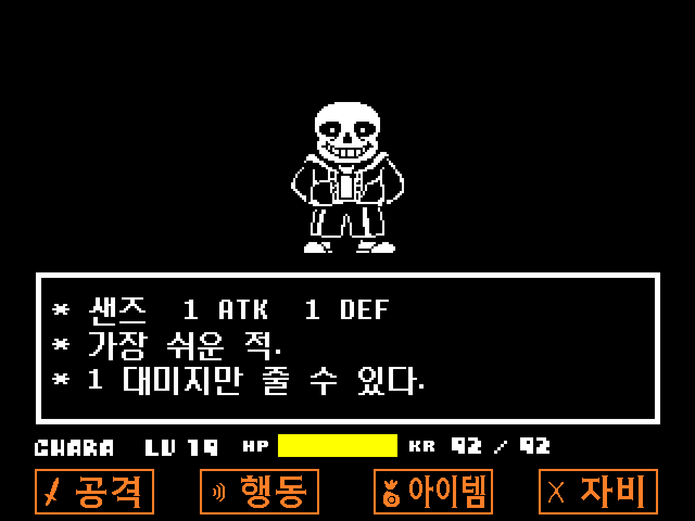

# 배드 타임 시뮬레이터 — 샌즈전 한글판

[**브라우저에서 플레이하기**](https://godxxy1229.github.io/c2-sans-fight-kr/)

[Jcw87의 Bad Time Simulator](https://github.com/Jcw87/c2-sans-fight)에 한국어 텍스트와 픽셀 글꼴을 적용한 팬 프로젝트입니다. 현재 시뮬레이터에 있는 메뉴, 아이템, 전투 설명, 짧은 대사와 안내 문구를 번역합니다. 원작의 생략된 대사는 추가하지 않으며 전투 패턴, 피해량, 입력과 아이템 효과는 원본과 같습니다.

전투 버튼은 [Minio-KR의 UNDERTALE 한글패치](https://github.com/Minio-KR/undertale-kr-translation)의 `EmbeddedTextures/2.png`에서 추출한 **공격 · 행동 · 아이템 · 자비** 이미지를 사용합니다. 기본 상태와 선택 상태를 모두 적용했습니다.

플레이어 이름은 원본 영문 `CHARA`를 유지합니다. `HP`, `LV`, `KR` 및 조작키 표기도 유지합니다.



## 조작

| 키 | 동작 |
| --- | --- |
| 방향키 | 이동, 메뉴 선택 |
| Z / Enter | 확인, 대사 넘기기 |
| X / Shift | 취소, 대사 즉시 표시 |
| X | 단일·커스텀 공격 모드에서 나가기 |
| 좌우 방향키 | 아이템 목록에서 다음·이전 페이지로 이동 |

PC의 최신 Chrome 또는 Edge를 권장합니다. 첫 입력 후 소리가 재생됩니다. 모바일에서는 원본의 터치 입력을 사용할 수 있지만 조작이 어렵습니다.

- **일반:** 샌즈전 전체 진행.
- **연습:** 공격별 성공·실패를 확인하며 연습.
- **무한:** 1단계 또는 2단계의 공격을 반복.
- **공격 선택:** 기존 공격 24개를 개별 실행.
- **사용자 지정 공격:** 호환되는 CSV 파일을 불러와 실행. 파일은 브라우저에서 읽으며 서버에 업로드하지 않습니다. 명령 형식은 [원본 제작 안내](upstream/source/Documentation/README.MD)를 참고하세요.

## 로컬에서 생성하고 실행하기

Python 3.13 기준입니다. 실행할 때 Construct 2나 UndertaleModTool은 필요하지 않습니다.

```powershell
python -m venv .venv
.\.venv\Scripts\python.exe -m pip install -r requirements.txt
.\.venv\Scripts\python.exe scripts/build.py
.\.venv\Scripts\python.exe -m http.server 8765 --bind 127.0.0.1 --directory dist
```

브라우저에서 `http://127.0.0.1:8765/`를 엽니다. `index.html`을 직접 더블클릭하는 `file://` 실행은 지원하지 않습니다.

macOS/Linux에서는 위 명령의 `.\.venv\Scripts\python.exe` 대신 `.venv/bin/python`을 사용하면 됩니다.

생성 결과:

- `source/`: 편집 가능한 한글 Construct 2 프로젝트. `.caproj` 파일을 Construct 2에서 엽니다. 생성 소스의 XML과 리소스는 자동 검증하며, Construct 2 에디터에서의 직접 열기·재내보내기는 별도 환경에서 확인해야 합니다.
- `dist/`: GitHub Pages 및 일반 정적 웹 서버용 실행판.
- `test-results/build-report.json`: 글꼴 정보, 버전 식별자, 정적 검증 결과.

두 출력 폴더는 생성 전 초기화됩니다. 영구 수정은 번역 목록이나 생성 스크립트에 반영하세요. 원본 두 프로젝트에서 가져온 입력은 `upstream/`과 `reference/`에 보존합니다.

## 번역과 재현성

`localization/ko.json`이 번역의 기준입니다. 각 항목은 이벤트 SID, 매개변수 위치, 예상 원문과 한국어 문구를 기록합니다. 동적 문장은 `concat`·`ref`·`select`로 구성하며 생성기가 소스 표현식과 웹 실행 표현식을 함께 만듭니다. 공격 목록은 표시명만 번역하고 `sans_*` ID는 유지합니다.

`scripts/build.py`는 다음을 수행합니다.

1. `upstream.lock.json`의 SHA-256으로 모든 원본 입력 확인.
2. 지정한 이벤트의 원문 확인 후 번역 적용. 원본에만 있는 비활성 대사 이벤트는 비활성 상태 유지.
3. 참조 글꼴의 좌표 CSV로 글자를 추출해 네 종류의 Sprite Font 이미지·글자표·폭 생성.
4. 참조 텍스처의 지정 좌표에서 110×42 버튼 8개를 추출하고 웹 아틀라스에도 반영.
5. 엔진 파일, 전투 이벤트, 공격 CSV의 비표시 데이터 보존 검사.
6. 웹 메타데이터·상대 경로·캐시 목록 생성. 산출물 내용으로 캐시 버전 결정.

번역은 NFC 완성형 한글을 사용합니다. 글꼴은 기본 ASCII와 배포 번역에 필요한 문자 집합을 포함합니다. 사용자 지정 CSV에 새로운 한글 대사를 추가하려면 해당 글자도 번역 목록에 포함하고 재생성해야 합니다. 폰트 원본에 없는 글자가 있으면 생성 단계에서 실패합니다.

Construct 2 엔진 `c2runtime.js`는 원본 그대로입니다. 새 엔진으로 재컴파일하는 대신, 고정한 원본 웹 내보내기의 데이터와 리소스를 변환합니다. 게임 로직을 변경하려면 새 원본 내보내기를 준비하고 SID·표현식 형식과 잠금 파일을 함께 검토해야 합니다.

## 검증

```powershell
.\.venv\Scripts\python.exe -m pip install -r requirements-test.txt
# 위 로컬 서버가 실행 중인 상태에서:
.\.venv\Scripts\python.exe scripts/browser_test.py --channel chrome
.\.venv\Scripts\python.exe scripts/browser_test.py --channel msedge
```

Chrome/Edge가 설치되어 있지 않은 환경에서는 `python -m playwright install chromium`을 실행한 뒤 `--channel chromium`을 사용합니다. 스크린샷과 보고서는 `test-results/`에 저장합니다.

브라우저 검증은 실제 키 입력으로 메뉴·아이템·대사 진행을 확인하고, 원래 게임 함수로 전투 종료 등의 상태에 진입해 긴 전투의 화면을 점검합니다. 모든 공격을 사람이 무피격으로 끝까지 플레이했다는 뜻은 아닙니다. 테스트용 상태 접근 코드는 배포 사이트에 포함하지 않습니다. 전투 동작 보존은 정적 데이터 비교로도 확인합니다.

## 배포

`main`에 push하면 GitHub Actions가 한글판을 생성하고 Chromium 통합 검증을 실행한 다음 `dist/`만 GitHub Pages에 배포합니다. 실패한 검증으로는 배포하지 않습니다. Pull request에서는 생성·검증만 수행합니다.

Actions 실행 결과에서 `sans-fight-kr-construct2` 아티팩트로 한글 프로젝트를, `validation-results`로 검증 결과를 받을 수 있습니다. Pages 설정의 배포 소스는 **GitHub Actions**입니다.

페이지를 다시 열면 서비스 워커가 새 버전을 확인합니다. 업데이트 완료 문구가 나오면 새로고침하세요. 첫 로딩이 완료된 뒤에는 오프라인 재접속도 지원합니다. 원본 사이트의 Google Analytics 설정은 포함하지 않습니다.

## 출처

- **UNDERTALE:** Toby Fox — [공식 홈페이지](https://undertale.com/). 원작의 캐릭터, 음악, 효과음, 그래픽.
- **Bad Time Simulator:** Jcw87 — [원본 저장소](https://github.com/Jcw87/c2-sans-fight). 소스 기준 `0bb6afe3764d3f4081ec00da1552950b2c2b08e4`, 웹 실행판 기준 `a1732fcddc0487e47ec8d903bcb0049a627e69c7`.
- **한국어 번역·글꼴·인터페이스:** 팀 왈도 번역 및 Minio-KR의 [UNDERTALE 1.08 한글패치](https://github.com/Minio-KR/undertale-kr-translation). 기준 커밋 `cd5eeab19ab106d3431819cfe9d7b8d94ab8d117`. 해당 프로젝트의 한글 글꼴 PNG/CSV, 인터페이스 텍스처, 아이템 이름과 전투 문구를 참고했습니다. 이 저장소에서는 시뮬레이터 화면에 맞게 공백·제어 코드·줄바꿈을 조정했습니다.

공식 UNDERTALE 배포판이나 공식 한국어판이 아닌 팬 프로젝트입니다. 포함된 원작·참조 자료의 권리는 각 제작자에게 있으며, 이 저장소가 그 자료에 새로운 라이선스나 재사용 허가를 부여하지 않습니다.
